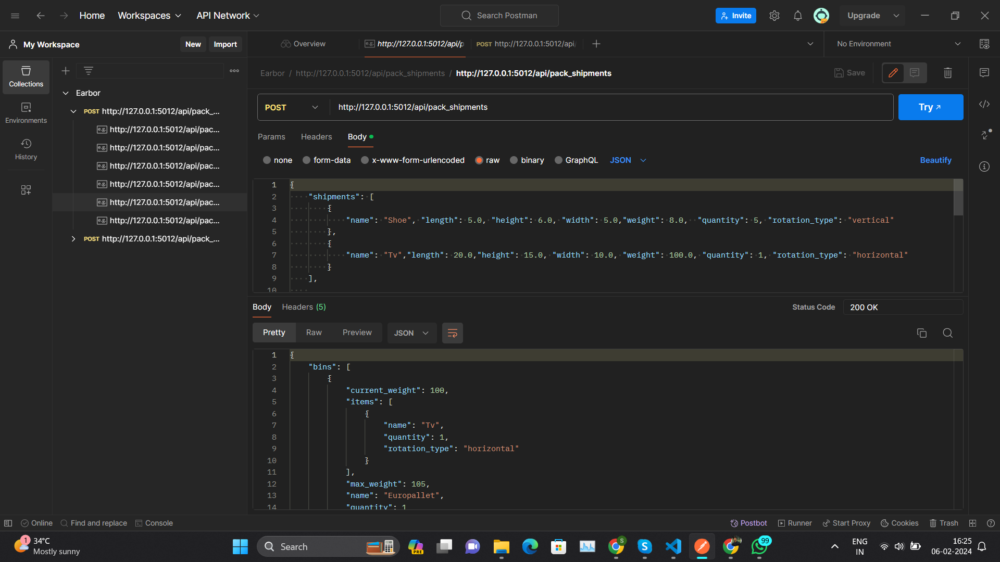
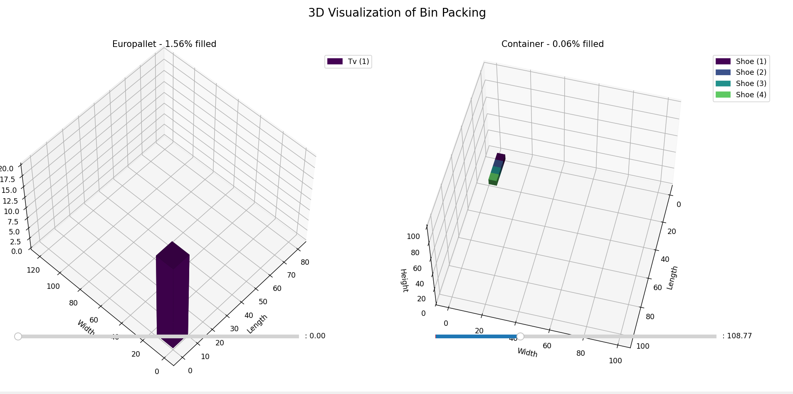

# 📦 OptiPack

[](https://opensource.org/licenses/Apache-2.0)

**OptiPack** is a Python-powered tool designed for intelligent 3D bin packing. It takes shipment and container specifications as input and uses optimization logic to pack them efficiently. It also generates **JSON outputs** and **3D visualizations**, and comes with a **REST API via Postman** for integration testing.

---

## 🔍 Use Case

Useful for:
- Warehouse optimization
- Shipment planning
- Supply chain and logistics simulation
- Educational demos of bin-packing logic and spatial constraints

---

## ⚙️ Features

- 📥 Accepts shipment/container data via JSON input
- 📦 Handles multiple bin types (e.g., Europallet, Container)
- 🔁 Supports item rotations and weight limits
- 🧠 Outputs structured JSON results
- 🖼️ Visualizes 3D packing results via `matplotlib`
- 🧪 Test-ready with Postman for API interaction

---

## 🛠️ Tech Stack


---

## 📁 File Structure

| File/Folder              | Description                            |
|--------------------------|----------------------------------------|
| `app.py`                 | Core script for running the solution   |
| `Sample input.txt`       | Example JSON input payload             |
| `Sample JSON Response.txt` | Example JSON response output          |
| `Sample output.png`      | Visualization of the packing solution  |
| `Postman.png`            | Screenshot of API tested via Postman   |

---

## 🚀 How to Run

1. **Install requirements:**
   ```bash
   pip install matplotlib numpy

2. **Run the Python App:**
   ```bash
   python app.py

---

## 🧪 Sample Input

- [Input](input.txt)

---

## 📂 Demo & Output Samples

- [JSON Response](JSONResponse.txt)
- 
- 

---

## 📖 License

This project is licensed under the [Apache License 2.0](LICENSE) © 2025 Mithunsankar S.
